# Visual Enhanced Entity-Relationship (EER) Diagram

Below is a visual representation of the Employee Payroll Management System database using Mermaid diagram notation. To view this diagram properly, use a Markdown viewer or editor that supports Mermaid syntax, such as GitHub, VS Code with Mermaid extension, or online Mermaid editors.

```mermaid
erDiagram
    DEPARTMENT {
        int dept_id PK
        string dept_name
        string location
        decimal budget
        int manager_id FK
    }
    
    JOB {
        int job_id PK
        string job_title
        decimal min_salary
        decimal max_salary
    }
    
    EMPLOYEE {
        int emp_id PK
        string first_name
        string last_name
        date date_of_birth
        char gender
        date hire_date
        int dept_id FK
        int job_id FK
        int manager_id FK
    }
    
    CONTACT_INFO {
        int contact_id PK
        int emp_id FK
        string email
        string phone
    }
    
    ADDRESS {
        int address_id PK
        int emp_id FK
        string street
        string city
        string state
        string postal_code
        string country
    }
    
    BANK_ACCOUNT {
        int account_id PK
        int emp_id FK
        string bank_name
        string account_number
        string branch_code
        bool is_primary
    }
    
    PAY_GRADE {
        int grade_id PK
        string grade_name
        decimal hourly_rate
        decimal tax_percentage
    }
    
    SALARY {
        int salary_id PK
        int emp_id FK
        int grade_id FK
        decimal base_salary
        date effective_date
        date end_date
    }
    
    PROJECT {
        int project_id PK
        string project_name
        date start_date
        date end_date
        decimal budget
        int dept_id FK
    }
    
    EMPLOYEE_PROJECT {
        int emp_id PK,FK
        int project_id PK,FK
        string role
        date assignment_date
    }
    
    ATTENDANCE {
        int emp_id PK,FK
        date attendance_date PK
        time time_in
        time time_out
    }
    
    EMPLOYEE_LEAVE {
        int leave_id PK
        int emp_id FK
        string leave_type
        date start_date
        date end_date
        string status
    }
    
    DEPENDENT {
        int emp_id PK,FK
        int dependent_id PK
        string first_name
        string last_name
        string relationship
        date date_of_birth
    }
    
    BENEFIT {
        int benefit_id PK
        string benefit_name
        string description
    }
    
    EMPLOYEE_BENEFIT {
        int emp_id PK,FK
        int benefit_id PK,FK
        date enrollment_date
    }
    
    HEALTH_INSURANCE {
        int benefit_id PK,FK
        string provider
        string policy_number
        decimal coverage_amount
    }
    
    RETIREMENT_PLAN {
        int benefit_id PK,FK
        string plan_type
        decimal contribution_percentage
        int vesting_period
    }
    
    PAYROLL {
        int payroll_id PK
        int emp_id FK
        date pay_period_start
        date pay_period_end
        decimal basic_pay
        decimal overtime_pay
        decimal bonus
        decimal tax_deduction
        decimal other_deductions
        decimal net_pay
        date payment_date
        string payment_method
    }
    
    PERFORMANCE_REVIEW {
        int review_id PK
        int emp_id FK
        int reviewer_id FK
        date review_date
        int rating
        string comments
    }
    
    DEPARTMENT ||--o{ EMPLOYEE : "has"
    JOB ||--o{ EMPLOYEE : "has"
    EMPLOYEE ||--o{ EMPLOYEE : "manages"
    EMPLOYEE ||--|| CONTACT_INFO : "has"
    EMPLOYEE ||--|| ADDRESS : "has"
    EMPLOYEE ||--o{ BANK_ACCOUNT : "has"
    EMPLOYEE ||--o{ SALARY : "has"
    EMPLOYEE ||--o{ ATTENDANCE : "has"
    EMPLOYEE ||--o{ EMPLOYEE_LEAVE : "has"
    EMPLOYEE ||--o{ DEPENDENT : "has"
    EMPLOYEE ||--o{ PAYROLL : "has"
    EMPLOYEE ||--o{ PERFORMANCE_REVIEW : "has"
    EMPLOYEE ||--o{ EMPLOYEE_PROJECT : "is assigned to"
    EMPLOYEE ||--o{ EMPLOYEE_BENEFIT : "enrolls in"
    DEPARTMENT ||--|| EMPLOYEE : "is managed by"
    DEPARTMENT ||--o{ PROJECT : "has"
    PROJECT ||--o{ EMPLOYEE_PROJECT : "has assignments"
    PAY_GRADE ||--o{ SALARY : "determines"
    BENEFIT ||--o{ EMPLOYEE_BENEFIT : "is enrolled by"
    BENEFIT ||--|| HEALTH_INSURANCE : "is a"
    BENEFIT ||--|| RETIREMENT_PLAN : "is a"
```

## Relationship Types and Cardinalities

The diagram uses the following notation for cardinalities:
- `||--o{` : One-to-many relationship
- `||--||` : One-to-one relationship
- `}o--o{` : Many-to-many relationship (implemented through junction tables)

## Key Features Illustrated

1. **Strong Entities**: All main tables like Department, Employee, Job
2. **Weak Entities**: Attendance, Dependent (composite key with Employee)
3. **IS-A Relationship**: Benefit as parent entity with HealthInsurance and RetirementPlan as child entities
4. **Composite Attributes**: Address broken down into street, city, state, etc.
5. **Multi-valued Attributes**: BankAccount (an employee can have multiple accounts)
6. **Self-referential Relationship**: Employee to Employee (manager relationship)
7. **Junction Tables**: EmployeeProject, EmployeeBenefit for many-to-many relationships

This visual diagram helps to understand the complete structure of the Employee Payroll Management System database, showing all entities, their attributes, and the relationships between them. 